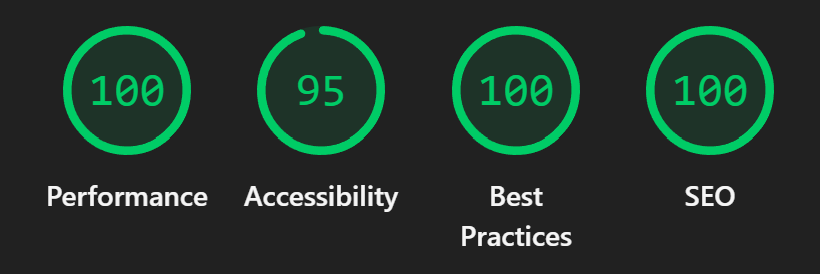

# Design Interior Website

## Links

**Live Demo**: https://wondrous-arithmetic-834a34.netlify.app/  
**Figma Layout**: [View Design](https://www.figma.com/design/FXH4IrR8Vho44BpcloBNfc/DEMO-for-Dima-Bukovsky?node-id=1-58522&p=f&t=kF4kdjyFvPSQP5aF-0)  
**Task Details**: https://innowise-group.atlassian.net/jira/software/c/projects/JST/boards/390?selectedIssue=JST-2602

## Short Project Overview

- **Responsive Design** - pixel-perfect layout across all devices
- **BEM Methodology** - Clean and maintainable CSS architecture
- **Semantic HTML5** - Accessible structure
- **Performance Optimized** - Lazy loading, optimized assets
- **Valid HTML/CSS** (W3C compliant)
- **Interactive Features** - Accordion sections, animated form inputs
- **SEO Optimized** - Meta tags, semantic markup, optimized content

## Local Installation

1. **Clone the repository**
   ```bash
   git clone https://github.com/OldPole/Design.git
   cd Design
   ```
2. **Open in browser**
   - Simply open `index.html` in your preferred browser
   - Or use live server extension in VS Code

## Performance & Validation Results

### Lighthouse Scores



### HTML Validation


### CSS Validation


### Accessibility Testing


